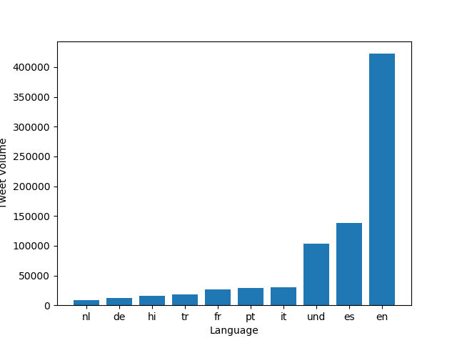
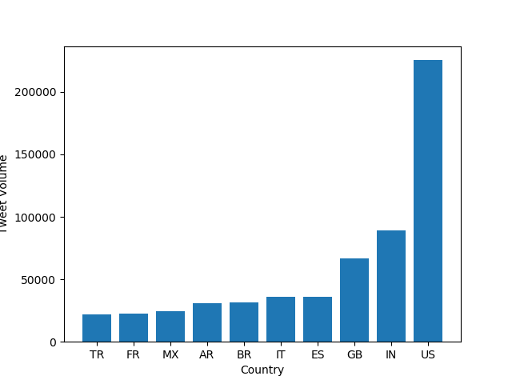
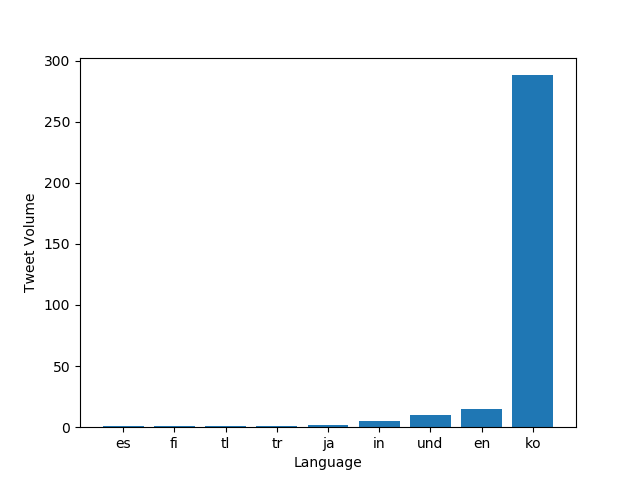
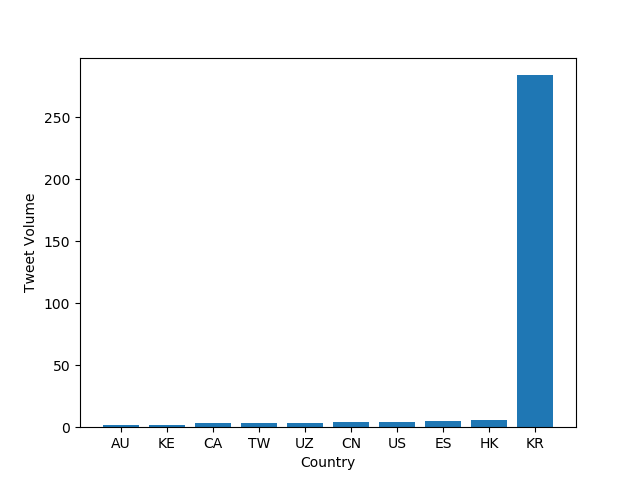
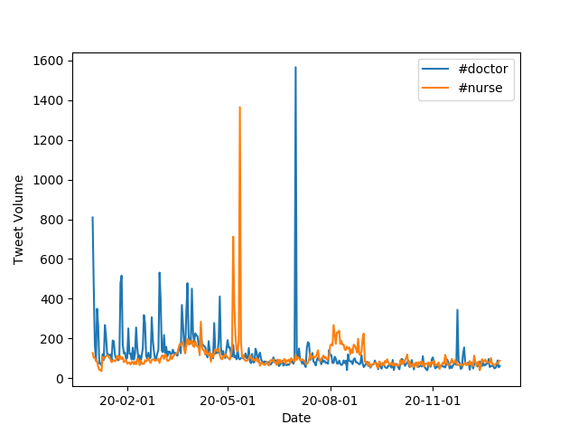

# Twitter Dataset Analysis

For this project, I used the mapreduce method and the matplotlib library to generate graphs illustrating the use of various hashtags related to the coronavirus for the year 2020.

The `map.py` file processes a zip file for an individual day of tweets and tracks the usage of the hashtags on both a language and country level. For example, the command 
```
$ python3 ./src/map.py --input_path=/data/Twitter\ dataset/geoTwitter20-02-16.zip
```
creates a folder called `outputs` that contains a file `/geoTwitter20-02-16.zip.lang`, which contains JSON formatted information summarizing the tweets from 16 February.

The `run_maps.sh` file loops over each file in the dataset and runs the `map.py` command on that file.
For example, the command
```
$ nohup sh run_maps.sh &
```
will run `maps.py` for all of the zip files for all the days in 2020.

The `reduce.py` file merges the outputs generated by the `map.py` file so that the combined files can be visualized. For example, the command
```
$ python3 ./src/reduce.py --input_paths outputs/geoTwitter20-*.lang --output_path=reduced.lang
```
generates a file called `reduced.lang` that contains data for all of hashtag usage by language for all of 2020. Additionally, the command
```
$ python3 ./src/reduce.py --input_paths outputs/geoTwitter20-*.country --output_path=reduced.country
```
generates a file called `reduced.country` that contains data for all of hashtag usage by country for all of 2020.

The `visualize.py` file takes `--input_path` and `--key` as inputs and generates a bar graph of the the top 10 languages/countries (depending on the `--input_path`) that used the hashtag specified by `--key` and stores the bar graph as a png file. For example, by running the command 
```
python3 ./src/visualize.py --input_path=reduced.lang --key='#coronavirus'
```
We get

## Use of #coronavirus in 2020 by Language



By running the command
```
python3 ./src/visualize.py --input_path=reduced.country --key='#coronavirus'
```
We get

## Use of #coronavirus in 2020 by Country



By running the command
```
python3 ./src/visualize.py --input_path=reduced.lang --key='#코로나바이러스'
```
We get

## Use of #코로나바이러 in 2020 by Language



By running the command
```
python3 ./src/visualize.py --input_path=reduced.country --key='#코로나바이러스'
```
We get

## Use of #코로나바이러 in 2020 by Country



The `alternative_reduce.py` file takes several `--keys` as inputs and outputs a line graph of the use of each key (in tweet volume) throughout the year.

By running the command
```
python3 ./src/alternative_reduce.py --keys '#doctor' '#nurse'
```
We get 
## Use of #doctor and #nurse Throughout 2020


By running the command
```
python3 ./src/alternative_reduce.py --keys '#doctor' '#nurse'
```
We get
## Use of #doctor and #nurse Throughout 2020


