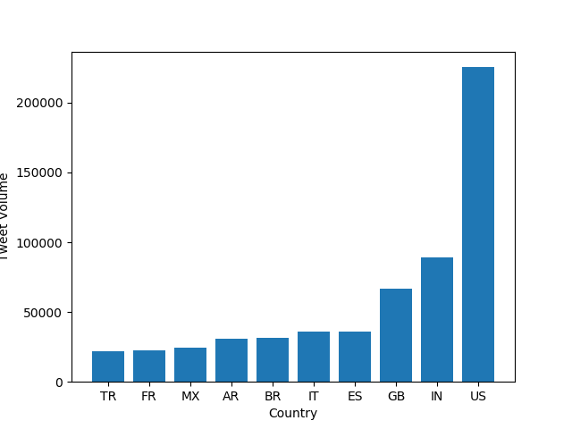
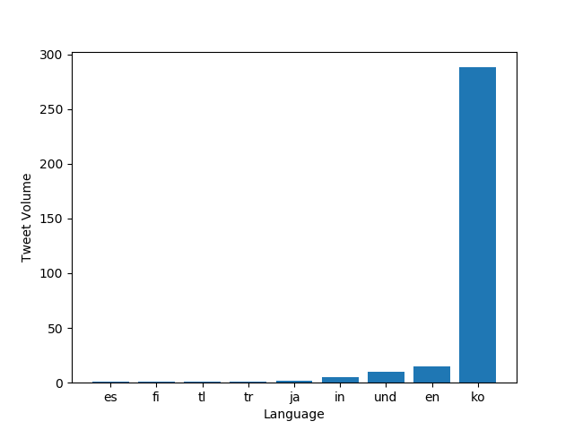
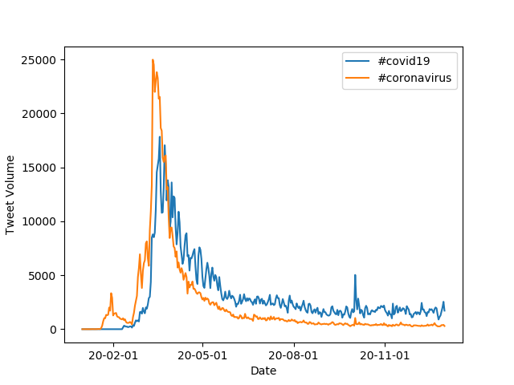
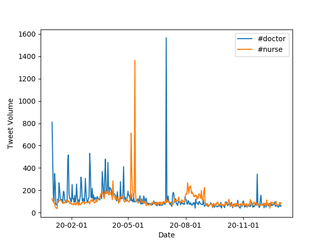

# Coronavirus twitter analysis


I was responsible for developing the code to analyze geotagged tweets from 2020 and monitor the spread of coronavirus on social media. The project involved working with large scale datasets, multilingual text, and implementing the MapReduce divide-and-conquer paradigm to create parallel code.

To achieve this, I created a `map.py` file that processed a zip file for an individual day of tweets and tracked the usage of hashtags on both a language and country level. For instance, running the following command generated a JSON file summarizing tweet data for February 16th:
bash

```
python3 ./src/map.py --input_path=/data/Twitter\ dataset/geoTwitter20-02-16.zip
```
The `run_maps.sh` file I developed looped over each file in the dataset and ran the `map.py` command on each file. By running the following command, the code was executed for all zip files for every day in 2020:

```
nohup sh run_maps.sh &
```

The `reduce.py` file merged the outputs generated by the `map.py` file, allowing us to visualize the combined data. Running the following command generated a `reduced.lang` file containing data for hashtag usage by language for all of 2020:

```
python3 ./src/reduce.py --input_paths outputs/geoTwitter20-*.lang --output_path=reduced.lang
```
Likewise, running the following command generated a `reduced.country` file containing data for hashtag usage by country for all of 2020:


```
python3 ./src/reduce.py --input_paths outputs/geoTwitter20-*.country --output_path=reduced.country
```
Finally, the `visualize.py` file allowed us to generate bar graphs of the top 10 languages or countries that used a specific hashtag. By running the following command, I used this tool to create visually appealing graphs that helped us gain insights into the spread of coronavirus on social media:

```
python3 ./src/visualize.py --input_path=reduced.lang --key='#coronavirus'
```
Overall, I was able to use my expertise in developing efficient and parallelized code to gain insights into the spread of coronavirus on social media.


## Use of #Coronavirus in 2020 by Language


By running the command
```
python3 ./src/visualize.py --input_path=reduced.country --key='#coronavirus'
```
The following visual is generated.

## Use of #Coronavirus in 2020 by Country



By running the command
```
python3 ./src/visualize.py --input_path=reduced.lang --key='#코로나바이러스'
```
The following visual is generated.

## Use of #코로나바이러 in 2020 by Language



By running the command
```
python3 ./src/visualize.py --input_path=reduced.country --key='#코로나바이러스'
```
The following visual is generated.

## Use of #코로나바이러 in 2020 by Country


The `alternative_reduce.py` file takes several `--keys` as inputs and outputs a line graph of the use of each key (in tweet volume) throughout the year.

By running the command
```
python3 ./src/alternative_reduce.py --keys '#doctor' '#nurse'
```
The following visual is generated.

## Use of #doctor and #nurse Throughout 2020


By running the command
```
python3 ./src/alternative_reduce.py --keys '#doctor' '#nurse'
```
Generated 

## Use of #doctor and #nurse Throughout 2020


